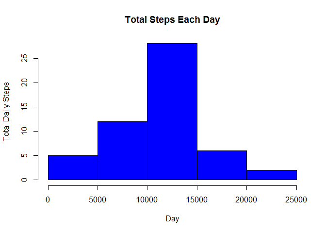
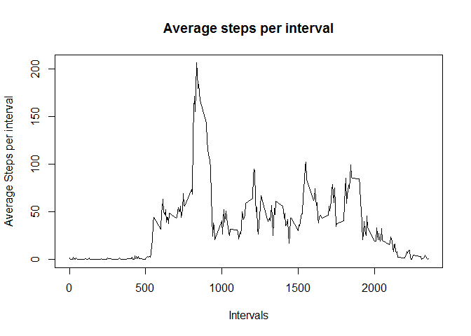
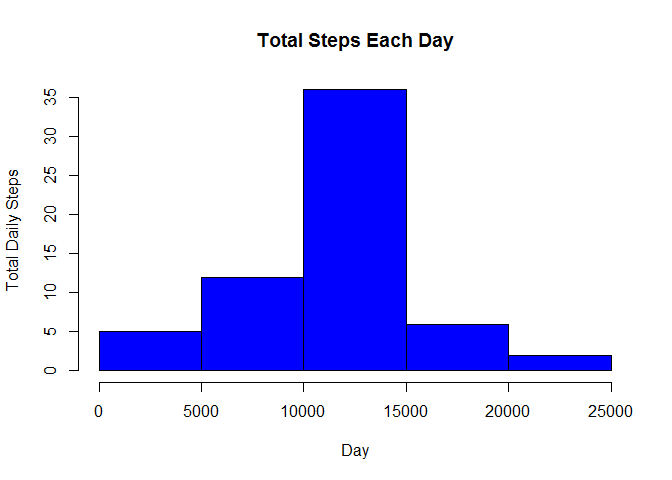

# Reproducible Research: Peer Assessment 1


```r
library(knitr)
opts_chunk$set(echo=TRUE)
```

## Loading and preprocessing the data

```r
activity <- read.csv("activity.csv", colClasses = c("numeric", "character", "numeric"), header=TRUE)
activity$date <- as.Date(activity$date, "%Y-%m-%d")
head(activity)
```

```
##   steps       date interval
## 1    NA 2012-10-01        0
## 2    NA 2012-10-01        5
## 3    NA 2012-10-01       10
## 4    NA 2012-10-01       15
## 5    NA 2012-10-01       20
## 6    NA 2012-10-01       25
```


## What is mean total number of steps taken per day?
####make a histogram of the total number of steps taken each day

```r
stepsTotal <- aggregate(steps ~ date, data = activity, sum, na.rm = TRUE)

hist(stepsTotal$steps, main = paste("Total Steps Each Day"), col="blue", xlab="Day", ylab="Total Daily Steps")
```

 
  
####calculate mean and median of total number of steps taken per day

```r
mean(stepsTotal$steps)
```

```
## [1] 10766.19
```

```r
median(stepsTotal$steps)
```

```
## [1] 10765
```


## What is the average daily activity pattern?
####Make a time series plot (i.e. type = "l") of the 5-minute interval (x-axis) and the average number of steps taken, averaged across all days (y-axis)

```r
averageInterval <- aggregate(steps ~ interval, activity, mean)
plot(averageInterval, type = "l", xlab="Intervals", ylab="Average Steps per interval", main="Average steps per interval")
```

 
  
####Which 5-minute interval, on average across all the days in the dataset, contains the maximum number of steps?

```r
averageInterval$interval[which.max(averageInterval$steps)]
```

```
## [1] 835
```


## Imputing missing values
####Calculate and report the total number of missing values in the dataset

```r
missing_values <- sum(is.na((activity$steps)))
print(missing_values)
```

```
## [1] 2304
```

####Devise a strategy for filling in all of the missing values in the dataset.
use the means for the 5-minute intervals as fillers for missing values

####create the new dataset

```r
activity.imputed <- activity
activity.imputed <- merge(activity, averageInterval, by = "interval", suffixes = c("", ".y"))
nas <- is.na(activity.imputed$steps)
activity.imputed$steps[nas] <- activity.imputed$steps.y[nas]
activity.imputed <- activity.imputed[, c(1:3)]
```

####Make a histogram of the total number of steps taken each day  

```r
steps_by_date_new <- aggregate(steps ~ date, data = activity.imputed, sum, na.rm = TRUE)
hist(steps_by_date_new$steps, main = paste("Total Steps Each Day"), col="blue", xlab="Day", ylab="Total Daily Steps")
```

 

####Calculate and report the mean and median total number of steps taken per day. Do these values differ from the estimates from the first part of the assignment? 

```r
mean(steps_by_date_new$steps)
```

```
## [1] 10766.19
```

```r
median(steps_by_date_new$steps)
```

```
## [1] 10766.19
```
After replacing the mean is the same but the median is a little bit different and became equal to the mean value

####What is the impact of imputing missing data on the estimates of the total daily number of steps?

```r
total_diff <- sum(steps_by_date_new$steps) - sum(stepsTotal$steps)
total_diff
```

```
## [1] 86129.51
```


## Are there differences in activity patterns between weekdays and weekends?

####Create a new factor variable in the dataset with two levels - "weekday" and "weekend" indicating whether a given date is a weekday or weekend day.

```r
daytype <- function(date) {
    if (weekdays(as.Date(date)) %in% c("Saturday", "Sunday")) {
        "weekend"
    } else {
        "weekday"
    }
}
activity.imputed$daytype <- as.factor(sapply(activity.imputed$date, daytype))
head(activity.imputed)
```

```
##   interval    steps       date daytype
## 1        0 1.716981 2012-10-01 weekday
## 2        0 0.000000 2012-11-23 weekday
## 3        0 0.000000 2012-10-28 weekend
## 4        0 0.000000 2012-11-06 weekday
## 5        0 0.000000 2012-11-24 weekend
## 6        0 0.000000 2012-11-15 weekday
```

####Make a panel plot containing a time series plot (i.e. type = "l") of the 5-minute interval (x-axis) and the average number of steps taken, averaged across all weekday days or weekend days (y-axis).

```r
#calculate the average for each interval
library(plyr)
average <- ddply(activity.imputed, .(interval, daytype), summarise, steps=mean(steps))
#draw histogram
library(lattice)
xyplot(steps ~ interval | daytype, data = average, layout = c(1, 2), type="l", xlab = "Interval", ylab = "Number of steps")
```

 

